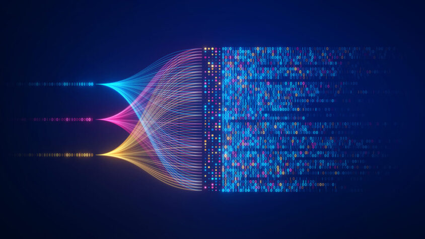

სიმბოლო? ფერი? სურათი ან სიმღერა?

note:
მინდა ერთი კითხვა დაგისვათ - საიდან იცის კომპიუტერმა როგორ გამოიყურება სიმბოლო? და ფერი? როგორ ინახავს ფოტოებს და სიმღერებს რომლებსაც ვუსმენთ?

ეს სტრიქონი რომ განახოთ შეძლებთ რომ მითხრათ რას ნიშნავს?

--

`11100001 10000011 10010010 11100001 10000011 10010000 11100001 10000011 10011011 11100001 10000011 10010000 11100001 10000011 10100000 11100001 10000011 10101111 11100001 10000011 10011101 11100001 10000011 10010001 11100001 10000011 10010000`

note:
რამდენადაც გასაკვირი არუნდა იყოს, ზუსტად ამ ფორმატში ინახავს კომპიუტერი ინფორმაციას.

ეს ნოლები და ერთები კი წარმოადგენენ ქართულ სიტყვას - გამარჯობა!

--

გამარჯობა

note:
take a deep breath for few seconds

---

რა არის მონაცემები? (Data)

note:
იმისთვის რომ გავიგოთ თუ რატომ იყენებს კომპიუტერი ასეთ უცნაურ ფორმატს, მოდით ჯერ შევხედოთ რა არის მონაცემები:
როგორც უკვე ვახსენე, ასოები, სიმბოლოები, ფერები, ხმები და ასე შემდეგ. ეს ყოველივე არის ინფორმაციის სხვადასხვაგვარი წარმოდგენები. 

--

ინფორმაცია

note:
შეგვიძლია გავიხსენოთ ბევრი საინტერესო მაგალითი ადამიანების ისტორიიდან როდესაც ინფორმაციის გასაგზავნად ან/და შესანახად საკმაოდ კრეატიულ ხერხებს ვიყენებდით:

--

![[Pasted image 20241220141111.png]]

note:

- ამერიკელი ინდიელები, ცნობილია რომ ქონდათ ეგრედ წოდებული "Smoke Signals" ანუ კვამლით ანიშნებდნენ ერთმანეთს შორ დისტანციებზე თავის სიტუაციის შესახებ, დიდი ნაჭრის გადასაფარებელი ქონდათ რომლითაც ამ ცეცხლის კვამლს აჩერებდნენ და გამოსდიოდათ წყვეტილი კვამლი 
	- ერთი წყვეტა შეიძლება ყოფილიყო ყურადღებისკენ მიწოდება
	- ორი წყვეტა იმის ნიშანი რომ ყველაფერი კარგად არის
	- სამი წყვეტა კი საშიშროების
- ასევე შეეძლოთ ორი პარალელური კოცონი  ქონოდათ, შეეძლოთ სხვადასხვა მცენარეების ჩამატება რომ კვამლის ფერი შეეცვალათ და ამასაც თავისი აზრი და მნიშვნელობა ქონდა

--
![[Pasted image 20241215124852.png]]

note:
ასევე ვიცით ბევრი მაგალითი ინფორმაციის შენახვის, იქნებოდა ეს გამოქვაბულში ამოქარგული სურათი ან დღეს უკვე დაკარგული ანბანით გაკეთებული წარწერა. რაც შემდეგ გადავიდა ქაღალდზე

--
![[Pasted image 20241215125147.png]]

note: გვქონდა ასეთი "სქროლები" სადაც ვინახავდით მნიშვნელოვან ან არც თუ ისე მნიშვნელოვან ცოდნას

--
![[Pasted image 20241215125329.png]]

note:
დღეს უკვე ნაკლებად აქტუალური თუმცა არც უძველესი დროის რაღაც - ბიბლიოთეკა. სადაც ვინახავთ ათასობით სხვადასხვა შინაარსის მქონე წიგნებს აქვე შეიძლება წიგნებში გვქონდეს ნახატები ან სურათები და შეიძლება ცალკე ალბომები გვქონდეს ამ სურათების.
მოკლედ ბიბლიოთეკა არის ძალიან მაგარი და თავის დროისთვის დიდი ინფორმაციის საცავი, თუმცა:

--
![[Pasted image 20241215130247.png]]

note:
დღეს ჩვენ გვაქვს ასეთი ყველასთვის ცნობილი მოწყობილობები, რომლების ციფრულად ინახავენ ძალიან პატარა კორპუსში მთელი ბიბლიოთეკის წიგნების ტექსტებს ან მათი შესაბამისი ზომის ინფორმაციას, რისთვისაც ადრე ცალკე შენობები გვქონდა).

--
ელექტროენერგია

note:
ჩვენი პროგრესი ინფორმაციის გაგზავნა/შენახვის ამბებში ძალიან დიდია ზუსტად ელექტროენერგიის დამსახურებით

--

![[Pasted image 20241215162259.png|500]]
.... . .\_.. .\_.. ___

H E L L O

note:
მორზეს კოდიც ინფორმაციის გადაცემის ერთერთი კარგი ხერხია, დაახლოებით 200 წლის წინ გამოიგონეს და დაიწყეს მისი გამოყენება: მუშაობის პრინციპი საკმაოდ მარტივია - ადამიანი ერთი ქალაქიდან მეორე ქალაქში აგზავნის ელექტრო სიგნალებს, მიმღებ ქალაქში კი მეორე ადამიანი ამ სიგნალებს ინტერპრეტირებს და გამართულ წინადადებებს იღებს. ინფორმაციის გადაცემის ასეთ ფორმას ერთი სირთულე აქვს - მიმღებს მისი თარგმნისთვის სჭირდება სიგნალის ხანგრძლივობის გაზომვა რაც დამატებითი ნაბიჯია.
![[Pasted image 20241215164420.png]]

--
vanaxot morse mighebuli tape, sadac chans wertilebi da tireebi da aris saechvo momenti romelsac adamiani kontekstualurad mixvdeba,
movashorot adamianuri faqtori da davtovot marto ori mdgomareoba 

--
ON / OFF

note:
ყველაზე მარტივი ფორმატი კი ორობითია. ორობითი ქვია რადგან მხოლოდ ორი მდგომარეობა აქვს 
- ჩართული - გამორთული
- კი - არა
- ყველაფერი - არაფერი
კომპიუტერისთვის რომელიც ყველაზე სიღრმისეულ დონეზე ელექტრო წრედია ასეთი სისტემა ყველაზე უფრო ბუნებრივია:
- შემოდის ელექტრო სიგნალი - თუ არა
- რადგან ამ მდგომარეობის ციფრულად წარმოდგენა გვინდა, დავუძახოთ ელექტრო სიგნალის არსებობას 1, ხოლო არ არსებობას 0

---
რატომ ორობითი?

notes:
მნიშვნელოვანია გვესმოდეს რატომ ორობითი? რატომ არ გვინდა გამოვიყენოთ ჩვეულებრივი რიცხვები - 7 ან 23? 

რადგან მარტივია და სანდო: წარმოიდგინეთ რომ ქმნით რაღაც ელექტრულ წრედს რომელმაც ინფორმაცია უნდა შეინახოს, უნდა შეამოწმოთ არის თუ არა ელექტროობა კონკრეტულ ადგილას, მარტივი *კი ან არა* ბევრად უფრო სანდოა ვიდრე თუნდაც ნახევრად ჩართული, მესამედით ჩართული ან დენის დაძაბულობის გაზომვა რაც ბევრად უფრო რთულია. 

სიმარტივე კი გვაძლევს სიჩქარეს, ეფექტურობას და ნაკლებ ალბათობას შეცდომების დასაშვებად

---

ASCII (როგორ ვინახავთ ტექსტს ორობითში)

--
$$A^{1} \space B^{2} \space C^{3} \space D^{4} ...$$

--
![[Pasted image 20241215133733.png]]

--

ათობითიდან ორობითში

---

RGB ფერები

---

![[Pasted image 20241214152621.png|750]]

---
How binary stores images

---
How binary stores sounds

---
What is this?

---
`01000001`

---
`(00000000), (00000000), (11111111).`
