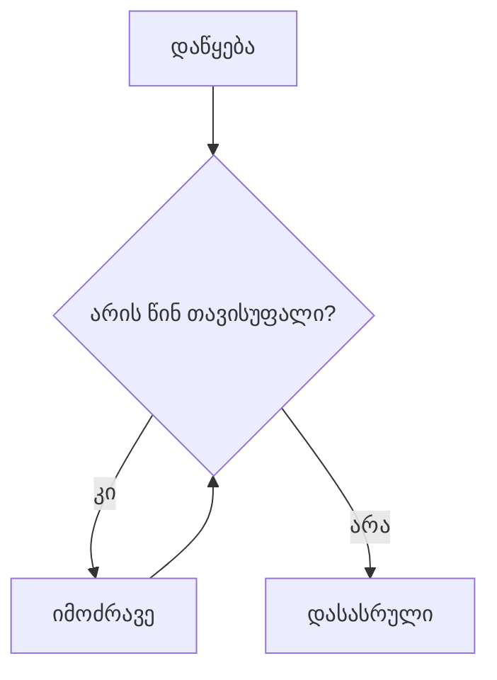
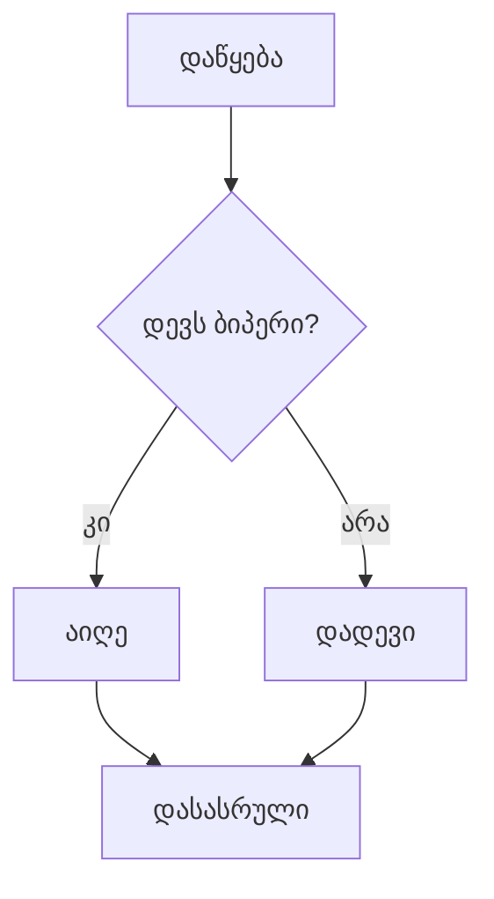
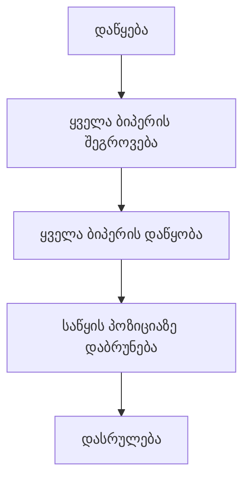

---

ალგორითმი

---


![[Pasted image 20241220131004.png]]

---

ინსტრუქცია = პროგრამული კოდი

---

ინსტრუქციების განსაზღვრა = დაპროგრამება

---

![[desert.jpg]]

---

![[robot.gif]]

---

![[launch.png]]

---

![[landing.gif|900x600]]

---

დავიწყოთ

---

კარლოს სამყარო

![[Pasted image 20241220132752.png|700x500]]

---

<div  style="background-color:white;">
<iframe
  width="600"
  height="600"
  src="https://rezi-gelenidze.github.io/karlo-ide/demo.html">
</iframe>
</div>

---

![[demo.gif|600x600]]

---

<div  style="background-color:white;">
<iframe
  width="900px"
  height="600px"
  src="https://rezi-gelenidze.github.io/karlo-ide/?task=pole1">
</iframe>
</div>

---

![[Pasted image 20241220135504.png]]

---

![[pole1.gif]]

---

<div  style="background-color:white;">
<iframe
  width="900px"
  height="600px"
  src="https://rezi-gelenidze.github.io/karlo-ide/?task=pole1">
</iframe>
</div>

---
![[Pasted image 20241220135618.png]]

---

![[pole.gif]]

---

<div  style="background-color:white;">
<iframe
  width="900px"
  height="600"
  src="https://rezi-gelenidze.github.io/karlo-ide/?task=pole2">
</iframe>
</div>

%%

```python
# move(), turn_left(), put_beeper(), pick_beeper()
def main():
    # მივიდეს და აიღოს ბიპერი
    move()
    pick_beeper()
    move()
    turn_left()
    
    # ავიდეს კედელზე
    move()
    turn_right()
    move()
    
    # წავიდეს და დადოს ბიპერი
    move()
    put_beeper()
    move()
    
    
def turn_right():
    turn_left()
    turn_left()
    turn_left()
```
%%

---

![[Pasted image 20241220143144.png]]

---

![[pothole.gif]]

---

<div  style="background-color:white;">
<iframe
  width="900px"
  height="600"
  src="https://rezi-gelenidze.github.io/karlo-ide/?task=pothole">
</iframe>
</div>

%%
```python
def main():
    move()
    fill_pothole()
    move()

# კარელი ავსებს მის წინ მდებარე ორმოს მასში ბიპერის მოთავსებით.
def fill_pothole():
    turn_right()
    move()
    put_beeper()
    turn_around()
    move()
    turn_right()

# აბრუნებს კარელს მარჯვნივ (90 გრადუსი)
def turn_right():
    turn_left()
    turn_left()
    turn_left()

# აბრუნებს კარელს უკან (180 გრადუსი)
def turn_around():
    turn_left()
    turn_left()
```
%%

---

- `move()`
- `turn_left()`
- `pick_beeper()` 
- `put_beeper()`

---

მაკონტროლებელი სტრუქტურები

---

როგორ დავდო 100 აგური?

---

![[Pasted image 20241220143454.png]]

---

![[forloopbeepers.gif]]

---

შესაძლო ამონახსნი

```python
def main():
		move()
		
		put_beeper()
		put_beeper()
		put_beeper()
		... 100 ჯერ გავიმეოროთ
		
		move()
```

---

for ციკლები

---

სინტაქსი

```python
for i in range(N):
	...ბრძანებები აბზაცს შიგნით
```

```python
for i in range(3):
	move()
```

```python
for i in range(16):
	turn_left()
```

---

<div  style="background-color:white;">
<iframe
  width="900px"
  height="600"
  src="https://rezi-gelenidze.github.io/karlo-ide/?task=placeBeepers">
</iframe>
</div>

---

კიდევ ერთი მაგალითი for ციკლებზე

---

![[Pasted image 20241220144401.png]]

---

1. ჩადი კუთხის ბოლოში
2. დადე აგური
3. მოტრიალდი მარცხნივ


---


![[corners1.gif]]

---
![[Pasted image 20241220144556.png]]

---
1. ჩადი კუთხის ბოლოში
2. დადე აგური
3. მოტრიალდი მარცხნივ
4. ჩადი კუთხის ბოლოში
5. დადე აგური
6. მოტრიალდი მარცხნივ..

---

![[corners2.gif]]

---
**გაიმეორე ოთხჯერ:**
1. ჩადი დაფის ბოლოში
2. დადე აგური
3. მოტრიალდი მარცხნივ

---


![[Pasted image 20241220144401.png]]

---


<div  style="background-color:white;">
<iframe
  width="900px"
  height="600"
  src="https://rezi-gelenidze.github.io/karlo-ide/?task=cornerBeepers">
</iframe>
</div>

%%
```python
def main():
    # repeat the body 4 times
    for i in range(4):
        put_beeper()
        move()
        move()
        move()
        turn_left()
```
%%

---

ჩაბუდებული ციკლები

---

![[Pasted image 20241220145033.png]]

---
გაიმეორე ოთხჯერ:
1. ჩადი დაფის ბოლოში
2. გაიმეორე ხუთჯერ:
	1. დადე აგური
3. მოტრიალდი მარცხნივ
---


<div  style="background-color:white;">
<iframe
  width="900px"
  height="600"
  src="https://rezi-gelenidze.github.io/karlo-ide/?task=cornerFiveBeepers">
</iframe>
</div>

---

დაფის ბოლოში ჩასვლა

```python
def main():
	move()
	move()
	move()
```

---

მუშაობს თუ სამყარო არის 4x4

---

როგორ გავხადოთ ალგორითმი უნივერსალური?

---

while ციკლები

---

სანამ წინ არის ადგილი:
1. წადი

---

![[Pasted image 20241220145625.png]]

---

![[Pasted image 20241220145647.png|500x500]]

---

![[Pasted image 20241220145730.png|500x500]]

---

სინტაქსი

```python
while condition():
	...ბრძანებები აბზაცს შიგნით
```

```python
while front_is_clear():
	move()
```

```python
while beepers_present():
	pick_beeper()
```


---

![[Pasted image 20241222182528.png]]

%%

%%

---

კარლოს მდგომარებობები (conditions)


![[Pasted image 20241223192858.png]]

%%

| მდგომარეობა         | საპირისპირო            | რას ამოწმებს?                   |
| ------------------- | ---------------------- | ------------------------------- |
| `front_is_clear()`  | `front_is_blocked()`   | არის წინა უჯრედი თავისუფალი?    |
| `beepers_present()` | `no_beepers_present()` | არის აგური მოცემულ უჯრედში?     |
| `left_is_clear()`   | `left_is_blocked()`    | არის მარცხენა მხარე თავისუფალი? |
| `right_is_clear()`  | `right_is_blocked()`   | არის მარჯვენა მხარე თავისუფალი? |
| `beepers_in_bag()`  | `no_beepers_in_bag()`  | აქვს აგურები კარლოს ჩანთაში?    |
| `facing_north()`    | `not_facing_north()`   | მიმართული ხარ ჩრდილოეთით?       |
| `facing_south()`    | `not_facing_south()`   | მიმართული ხარ სამხრეთით?        |
| `facing_east()`     | `not_facing_east()`    | მიმართული ხარ აღმოსავლეთით?     |
| `facing_west()`     | `not_facing_west()`    | მიმართული ხარ დასავლეთით?       |
%%

---

ამოხსნა while ციკლით

---

<div  style="background-color:white;">
<iframe
  width="900px"
  height="600"
  src="https://rezi-gelenidze.github.io/karlo-ide/?task=moveToWall">
</iframe>
</div>

---

დავაწყოთ აგურები მოძრაობასთან ერთად

---


<div  style="background-color:white;">
<iframe
  width="900px"
  height="600"
  src="https://rezi-gelenidze.github.io/karlo-ide/?task=beeperLineBug">
</iframe>
</div>

---

if-else პირობითი სტრუქტურები

---

![[Pasted image 20241220152019.png]]

---

![[invertor.gif]]

---

მიზანი
1. მწკრივის ბოლოში ჩასვლა
2. თუ აგური დევს აიღოს, თუ არ დევს დადოს

---

ფსევდო კოდი

```
სანამ წინ ცარიელია:
	თუ აგური დევს:
		აიღე აგური
	თუ არადა:
		დადევი აგური
	წადი
```

---

if ბლოკი

```python
if condition():
	...ბრძანებები აბზაცს შიგნით
```

```python
if front_is_clear():
	move()
```

---
if-else ბლოკი

```python
if condition():
	...ბრძანებები აბზაცს შიგნით
else:
	...ბრძანებები აბზაცს შიგნით
```

```python
if beepers_present():
	pick_beeper()
else:
	put_beeper()
```


---

![[Pasted image 20241222182151.png]]

%%


%%

---

<div  style="background-color:white;">
<iframe
  width="900px"
  height="600"
  src="https://rezi-gelenidze.github.io/karlo-ide/?task=invertBeepers">
</iframe>
</div>

---

შევაჯამოთ

---

პროგრამული კოდი

---

დაპროგრამება

---

- `move()`
- `turn_left()`
- `pick_beeper()` 
- `put_beeper()`

---

სტრუქტურა

```python
def main():
    move()
    pick_beeper()
    move()
```

---

ჩვენი შექმნილი ბრძანებები

```python
def main():
    move()
    turn_right()
    move()

def turn_right():
    turn_left()
    turn_left()
    turn_left()
```

---

for ციკლი

```python
for i in range(N):
	...ბრძანებები აბზაცს შიგნით
```

```python
for i in range(3):
	move()
```

როცა გვინდა ოპერაციის N ჯერ გამეორება

---

while ციკლი

```python
while condition():
	...ბრძანებები აბზაცს შიგნით
```

```python
while front_is_clear():
	move()
```


როცა გვინდა გავიმეოროთ ოპერაცია, მანამ, სანამ პირობა ჭეშმარიტია

---
if ბლოკი

```python
if condition():
	...ბრძანებები აბზაცს შიგნით
```

```python
if front_is_clear():
	move()
```

ვმოქმედებთ თუ პირობა ჭეშმარიტია

---
if-else ბლოკი

```python
if condition():
	...ბრძანებები აბზაცს შიგნით
else:
	...ბრძანებები აბზაცს შიგნით
```

```python
if beepers_present():
	pick_beeper()
else:
	put_beeper()
```

ვასრულებთ if ბლოკის ბრძანებებს თუ პირობა ჭეშმარიტია, თუ არადა ვასრულებთ else ბლოკის ბრძანებებს.

---

მოვიკრიბოთ ძალა და ცოდნა

---

![[Pasted image 20241220153901.png]]

---

![[collector.gif]]

---

1. უნდა იმოძრაოს მწკრივის ბოლომდე
2. ყოველ უჯრედზე თუ კოშკი არის აყვეს და აკრიფოს აგურები
3. ბოლოში ჩასვლისას დაალაგოს ყველა აგური
4. დაბრუნდეს თავდაპირველ პოზიციაში

---

<div  style="background-color:white;">
<iframe
  width="900px"
  height="600"
  src="https://rezi-gelenidze.github.io/karlo-ide/?task=beeperCollector">
</iframe>
</div>


%%
```python
def main():
    collect_all_beepers()
    drop_all_beepers()
    return_home()
  
def collect_all_beepers():
    while front_is_clear():
      collect_one_tower()
      move()
    collect_one_tower()

def collect_one_tower():
    turn_left()
    collect_line_of_beepers()
    turn_around()
    move_to_wall()
    turn_left()

def collect_line_of_beepers():
    while beepers_present():
      pick_beeper()
      if front_is_clear():
          move()

def drop_all_beepers() :
    while beepers_in_bag():
      put_beeper()

def return_home():
    turn_around()
    move_to_wall()
    turn_around()

def move_to_wall():
    while front_is_clear():
      move()
  
def turn_around():
    turn_left()
    turn_left()
```
%%

---

![[Pasted image 20241223191934.png]]

%%

%%
---

To Be Continued

